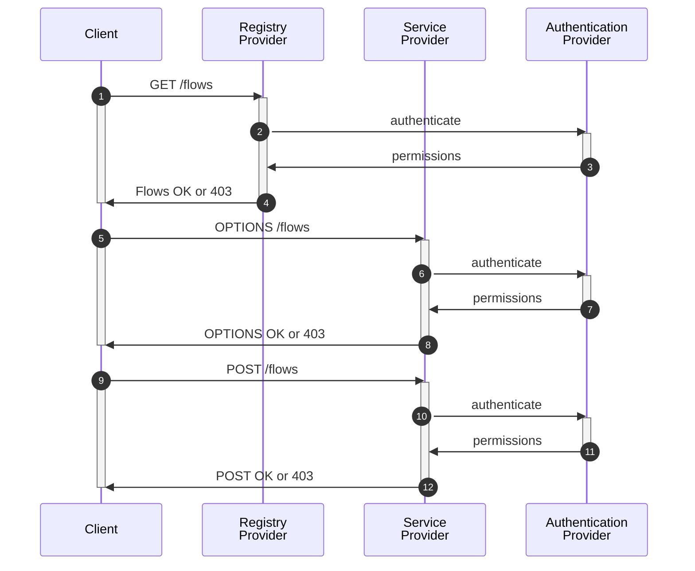

## AUTHENTICATION

The registry provider is decoupled from the auth provider. The following diagram depicts the interaction between _registry provider_, _client_, _service provider_ (node) and _authentication provider_:

The Auth Provider is responsible for user and group management, permission management. All communication cross network depends and relies on it to provide authentication and authorization to access

1) nodes
2) flows, 
3) event (flow details and results)

##### access to nodes

A node is identified by its domain name or IP address. Access is granted (`node://<domain-name>`) or not (`~`).

##### access to flows

A flow is identified by its `yaml` file path, or a `crewai` `Crew` or `Flow` package module path (`qual_name`). Access is granted on three *levels* (*basic*, *advanced* and *full*) and two *modes* (*read* and *execute*):
* `flow://<qual-name>/<0|1|2>/<r|x>`) with
    - level 0 (basic): events _input_, _version_, _crew_, _progress_ and _final_
    - level 1 (advanced): basic plus events _result_, _result-error_
    - level 2 (full): advanced plus events _config_, _agent_, _task_, _action_, _action-error_

**example:**
* `flow://soko.serviceplan.com/basic/x` - can execute and see results
* `flow://soko.serviceplan.com/full` - cannot execute but full access to inputs and outputs

## NO AUTH

Key feature of **kodosumi** is that it runs independent of **masum**. This is achieved with a clear interface kodo/masu and a default `Null` Handler. The default auth provider of **kodo** is to let all access through.