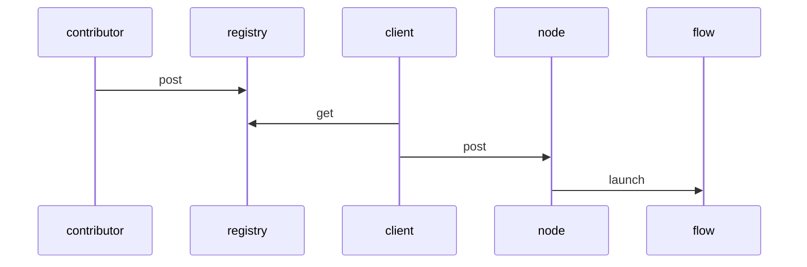
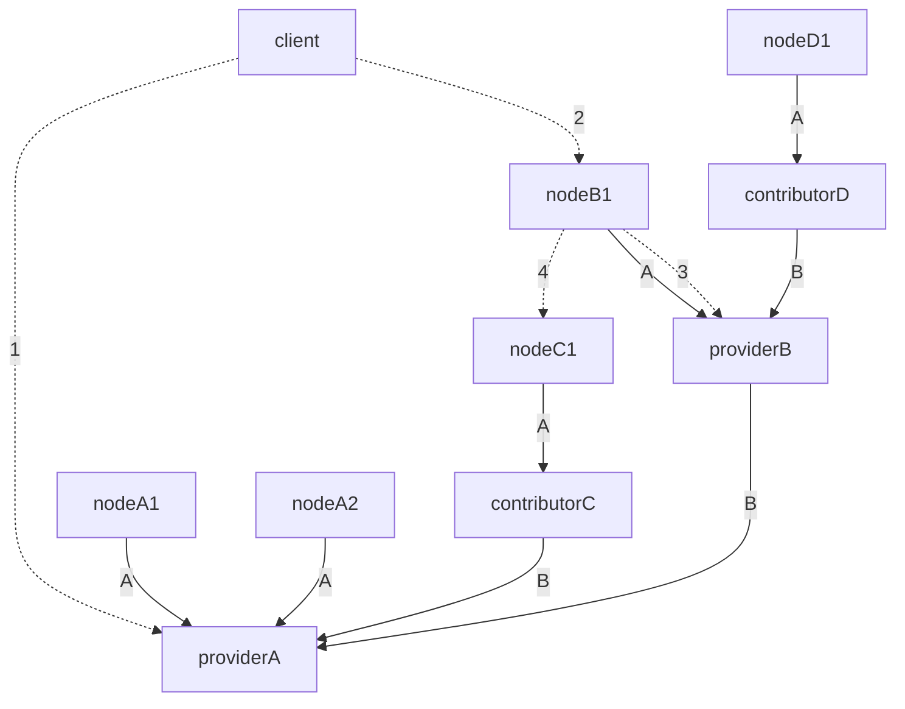

We talked about the following **key** components and discussed purpose, scope and if it is part of kodo/soko/masu. This is the summary and conclusion.

- **registry provider**
- **registry contributor** (AKA _registry source_)
- **auth provider**
- **node-registry interaction**
- **client-registry interaction**
- **client-node interaction**

**Registry Provider** - is the central repository of nodes and agents available in the network. Used to explore, navigate the list of nodes/agents and used by nodes to register and say hello. A registry provider is capable to merge and mesh registries from other registry providers and registry contributors.

**Registry Contributor** - is a decentral repository of nodes and agents available in the network. Exploration, navigation, registration and handshake with nodes apply here, too. The difference to a registry provider is that the contributor can handle one registry only.

**Auth Provider** - manages and authorize interaction between users, user roles, nodes including registry providers, flows, events (results etc.).

**Node-Registry Interaction** - the node announces to its registries the offering of flows and with health state and heartbeats in intervals.

**Client-Registry Interaction** - From a marketplace perspective the client interacts with the registry to navigate and explore (other) nodes and agents.

**Client-Node Interaction** - The client directly interacts with the node and its flows. The registry has no stakes in this interaction. Also the marketplace, even though it is initiating the interaction between a client and a node in most scenarios, it is a direct client-node communication which manages flow input, demand and output.

**note** on _inter-node agents_: the flow can use (a tool) which queries a registry provider as a data source, select an agent, and contact the node to launch an agent on a different node. In this respect, the flow impersonates a _client_ in the sequence chart above.

**note** on _authentication and permission control_: all requests above require authentication and appropriate access permissions to 1) access the registry, 2) access the node and 3) access the flow

**note** on _terms_: I use _node_ as the brain node. The node is indeed the _driver_ of the flow. The flow is then running on _workers_. _Workers_ feature scalabililty and are a component of the cluster but can run on a single machine, too.

## INTERACTION DIAGRAM

**comments:** This activity or interaction diagram exemplifies the component interaction.
**registry interaction**: **_(A)_** a node registers to a registry provider or contributor. **_(B)_** a registry provider or contributor registers to another registry provider.
**flow interaction:** **_(1)_** a client explores the registry (`providerA`). **_(2)_** The client selected and now connects to a node related to the target agent. **_(3)_** During flow execution the agent reaches a point where it seeks to delegate work to another agent. The flow connects to a registry provider (`providerB`) it identify the remote agent. The selection is beyond the scope of this comment. **_(4)_** With the matching agent and corresponding node the flow running still on `nodeB1` can now connect to `nodeC1` hosting the target agent. The remote agent response is consumed by the flow running on `nodeB1`.
