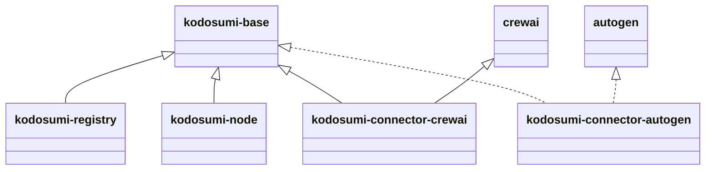

# Kodosumi Codebase
## General
All the deliverables will be written in Python
## Package overview

- kodosumi-base : contains all the models (DTOs) and the base connector interface
- kodosumi-registry
- kodosumi-node
- kodosumi-connector-* - those will contain concrete implementations of the connectors/workers