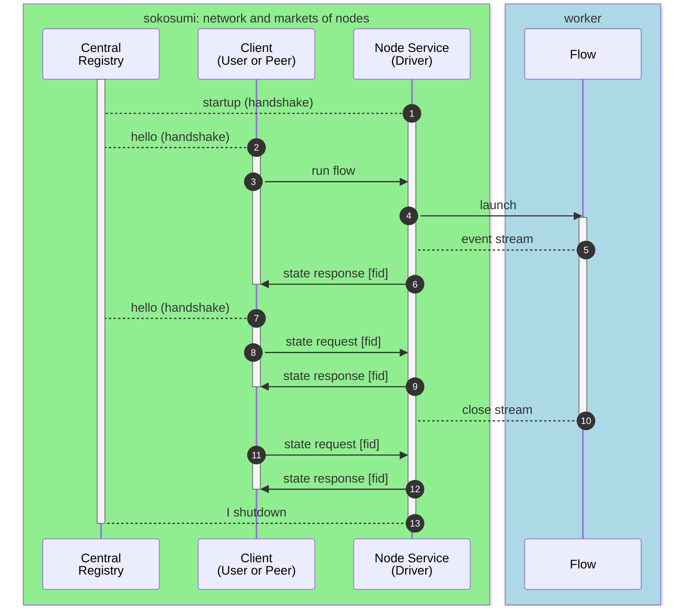
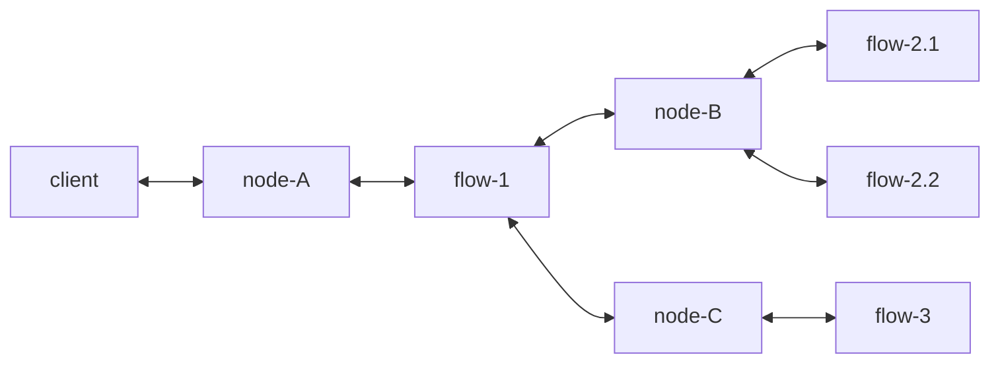
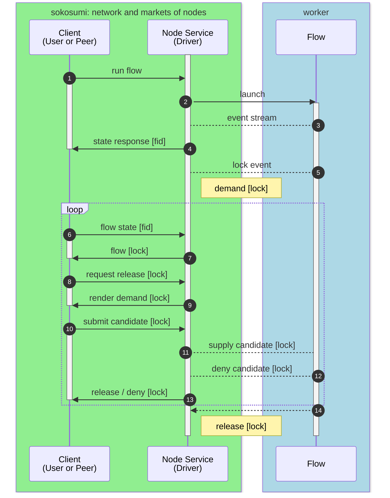

The node is the driver for flow execution. The following sequence diagram shows the interaction between _node_ and the _registry_, _client_, and _flow_. 

**_Comment:_** **[1]** The node starts up, connects and registers with the registry. **[2]** The client connects to the registry, selects a flow of a node and **[3]** asks the node service to run the promoted flow. **[4]** The node service launches the flow. On successful launch **[5]** a shared event state stream is established between the service driving the flow and the worker running the flow. On success **[6]** the node service delivers the initial flow event state back to the client including the flow id (`fid`).  The client can **[7]** reconnect with the registry and **[8]**-**[9]** query the flow state. When **[10]** the flow finishes, it closes the event stream and destroys the shared event state and stream|state between the driver and the worker. With `node+rid` the client can **[11]** - **[12]** query the flow state after completion as the node service persists the flow event stream locally. Eventually the node service **[13]** unregisters from the registry on shutdown.

## NODE INTERACTION

### INTERACT with other NODEs

The flow can interact as a _client_ with other nodes and request flow execution using data from the registry. 

### INTERACT with HUMANs (HITL)

A flow can interact with the client user. The **state request** of the client indicates a _lock_. The client can `POST` the release candidate payload to the node service and request to _release_ the lock. The submitted `POST` can be either accepted (`200 OK`) by the flow and the lock is released. Or the flow silently denies the payload (`100 Continue`). 

> **Technical Note**
>
> Most flows start with a _lock_ and indicate demand for `inputs` arguments. Fully automated flows **bypass the initial lock** by providing sufficient `inputs` arguments at launch time. 

##### LOCK

The LOCK is operationalized as an `Actor` `.lock` property. If `.lock is not None:`

- the flow _waits_ for release _candidates_ until timeout (_demand-side_: `no-candidate-timeout`)
- the node service renders `GET` and accepts `POST /{fid}/lock/{lid}/candidate` to translate the payload into a release _candidate_ event
    - the node service waits for _release_ or _deny_ (both are events) of the _candidate_ until _timeout_ (_client-side_: `release-timeout`)

##### LOCK SEQUENCE

The following sequence chart focuses on the lock interaction, which is not relevant for the registry. Therefore all interaction with the registry (handshaking and heartbeat) is not displayed.

